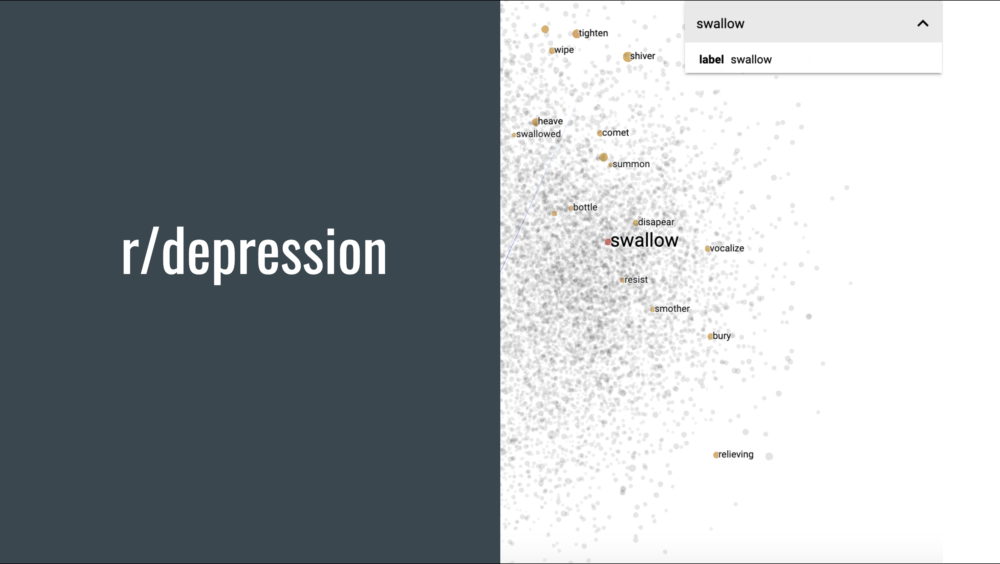

### Exploring the language of posts from r/depression and r/mentalhealth with topic modeling and word embeddings.
 

[depression viz](https://projector.tensorflow.org/?config=https://raw.githubusercontent.com/dirtylittledirtbike/project_04/main/tensorboard_files/demo_json/template_projector_config.json)
